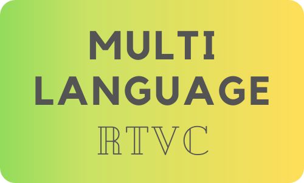

*****

*****

``Multi-Language-RTVC`` stands for Multi-Language Real Time Voice Cloning and is a Voice Cloning Tool capable
of transfering speaker-specific audio features to synthesize speeches in that voice based on just a few
seconds of unknown audio data.

## License

This code is licensed under ``MIT``. For more information regarding the license model or
associated duties and rights, click [here](LICENSE).

## Project History

This project was started in 2021 with the goal of inheriting Corentin Jemine's [``Real-Time-Voice-Cloning``](https://github.com/CorentinJ/Real-Time-Voice-Cloning).
The project originated from the wish of multi-language support for voice cloning models and is now
maintained and enhanced by contributing volunteers. Visit the [``About us``](https://github.com/sveneschlbeck/Multi-Language-RTVC/wiki/About-us) section to learn more about the team behind ``MLRTVC``.

## Contributing

We welcome all those interested in the project, from beginners to experts. The MLRTVC community standard is
a nice, open-minded and efficient working climate. We encourage all those with ideas to take part in the
project by sharing their thoughts.  
There are multiple meaningful ways of contributing:

- Developing code (new features, fixes, enhancements)
- Writing documentation
- Raising issues (bugs, feature requests, enhancement proposals, code refacturing, etc.)
- Providing pre-trained models
- Participating in community tasks (code reviews, discussions, maintenance, etc.)

For transparacy reasons, we ask you to engage with this project via the official ways (issues, pull requests)
to share knowledge and questions publicly. Only in cases where privacy or confidentiality is of great importance,
other communication channels are accepted (email, chat, etc.).

Further information can be gained in the [``Contributing Guidelines``](CONTRIBUTING.md).

## Code of Conduct

Working together on this project, we share and defend certain values which are indispensable
for an Open Source project like ``MLRTVC``. For further information see [here](https://github.com/sveneschlbeck/Multi-Language-RTVC/blob/main/CODE_OF_CONDUCT.md).

## Help & Support

### Documentation

- Theory behind ``MLRTVC``: https://github.com/sveneschlbeck/Multi-Language-RTVC/wiki/Theory
- FAQ: https://github.com/sveneschlbeck/Multi-Language-RTVC/wiki/Frequently-Asked-Questions-(FAQ)

### Communication

- Stack Overflow: https://stackoverflow.com/questions/tagged/mlrtvc
- GitHub Discussions: https://github.com/sveneschlbeck/Multi-Language-RTVC/discussions
