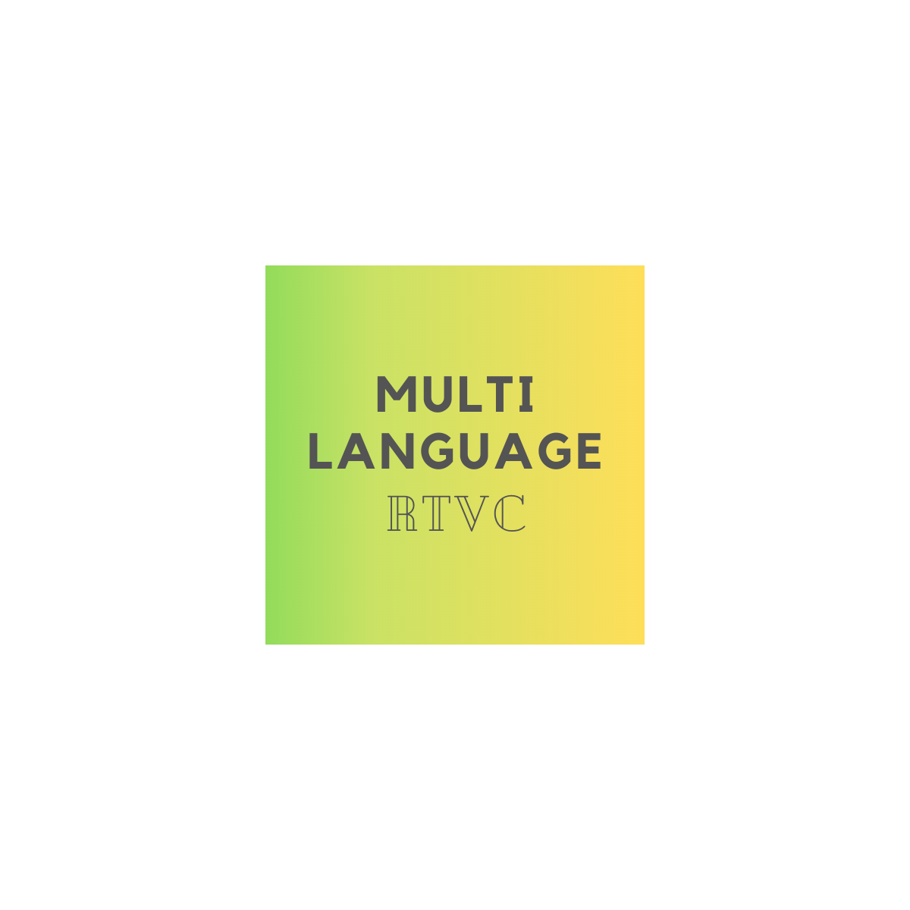

*****

*****

[]

## Project description

``Multi-Language-RTVC`` stands for Multi-Language Real Time Voice Cloning and is a Voice Cloning Tool capable
of transfering speaker-specific audio features to synthesize speeches in that voice based on just a few
seconds of unknown audio data.
